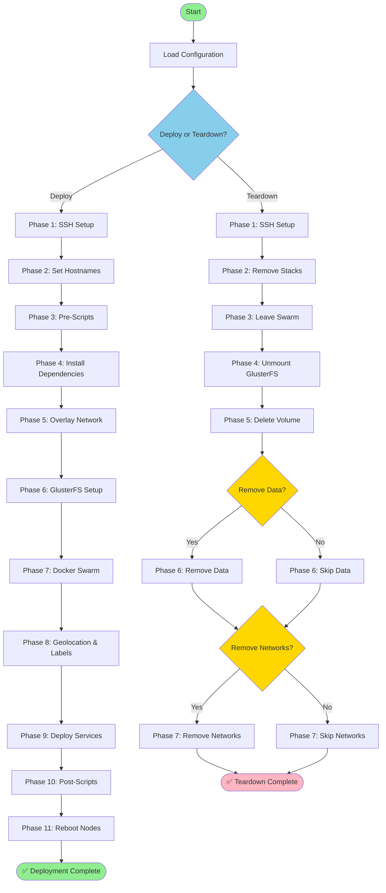

# Docker Swarm Cluster Configuration Service

`clusterctl` is a Go-based orchestrator that automates Docker Swarm cluster deployment, management, and teardown with GlusterFS storage integration via SSH.

## Features

- ✅ **Automated Deployment** - Deploy complete Docker Swarm clusters from JSON configuration
- ✅ **SSH-Based Orchestration** - Server-initiated connections, no agents required
- ✅ **GlusterFS Integration** - Replicated storage with automatic setup
- ✅ **Overlay Networking** - Support for Netbird, Tailscale, and WireGuard
- ✅ **Service Deployment** - Generic YAML-based service deployment system
- ✅ **Teardown/Reset** - Clean cluster removal with optional data preservation
- ✅ **Geolocation Detection** - Automatic region detection and node labeling

## Deployment & Teardown Flow



## Quick Start

### Deploy a Cluster

```bash
# 1. Create a configuration file (see binaries/clusterctl.json.example)
cp binaries/clusterctl.json.example clusterctl.json

# 2. Edit the configuration with your nodes and credentials
nano clusterctl.json

# 3. Deploy the cluster
./binaries/clusterctl-linux-amd64 -config clusterctl.json
```

### Teardown a Cluster

```bash
# Teardown cluster (keeps networks and data for connectivity)
./binaries/clusterctl-linux-amd64 -config clusterctl.json -teardown

# Full teardown (removes everything including data - WARNING: destructive)
./binaries/clusterctl-linux-amd64 -config clusterctl.json -teardown -remove-overlays -remove-gluster-data
```

### Deployment Phases

When you run `clusterctl -config clusterctl.json`, the following phases execute:

1. **Phase 1**: SSH Connection Pool - Establish SSH connections to all nodes
2. **Phase 2**: Set Hostnames - Idempotently set new hostnames (if configured)
3. **Phase 3**: Pre-Deployment Scripts - Execute custom scripts before setup
4. **Phase 4**: Install Dependencies - Install Docker, overlay provider, GlusterFS
5. **Phase 5**: Configure Overlay Network - Setup VPN mesh (Netbird/Tailscale/WireGuard)
6. **Phase 6**: Setup GlusterFS - Create trusted storage pool, volume, and mounts
7. **Phase 7**: Setup Docker Swarm - Initialize swarm and join nodes
8. **Phase 8**: Detect Geolocation & Apply Labels - Auto-detect region and apply all labels
9. **Phase 9**: Deploy Services - Deploy services from `binaries/services/` folder
10. **Phase 10**: Post-Deployment Scripts - Execute custom scripts after setup
11. **Phase 11**: Reboot Nodes - Gracefully reboot nodes (if configured)
12. **Phase 12**: SSH Key Cleanup - Remove SSH keys from nodes (if configured)

### Teardown Phases

When you run `clusterctl -config clusterctl.json -teardown`, the following phases execute:

1. **Phase 1**: SSH Connection Pool - Establish SSH connections to all nodes
2. **Phase 2**: Remove Stacks - Remove all deployed Docker stacks
3. **Phase 3**: Leave Swarm - All nodes leave the Docker Swarm
4. **Phase 4**: Unmount GlusterFS - Unmount GlusterFS volumes on managers
5. **Phase 5**: Delete Volume - Stop and delete GlusterFS volume
6. **Phase 6**: Remove Data (Optional) - Remove GlusterFS data directories (`-remove-gluster-data`)
7. **Phase 7**: Remove Networks (Optional) - Remove overlay networks (`-remove-overlays`)

**Key Features:**
- ✅ **Parallel execution** - All nodes configured simultaneously for speed
- ✅ **Idempotent** - Safe to re-run, only changes what's needed
- ✅ **Automatic detection** - Geolocation, overlay IPs, and advertise addresses
- ✅ **No primary master required** - Deploy from any control server
- ✅ **Comprehensive labeling** - Automatic geo + infrastructure + custom labels

### Configuration File Format

See `binaries/clusterctl.json.example` for a complete example. The configuration has two main sections:

#### Global Settings

```json
{
  "globalSettings": {
    "clusterName": "production-swarm",
    "overlayProvider": "netbird",
    "overlayConfig": "your-netbird-setup-key-here",
    "glusterVolume": "docker-swarm-0001",
    "glusterMount": "/mnt/GlusterFS/Docker/Swarm/0001/data",
    "glusterBrick": "/mnt/GlusterFS/Docker/Swarm/0001/brick",
    "servicesDir": "",
    "removeSSHPublicKeyOnCompletion": false,
    "preScripts": [
      {
        "enabled": true,
        "name": "pre-deployment-check",
        "source": "https://example.com/scripts/pre-check.sh",
        "parameters": "--verbose"
      }
    ],
    "postScripts": [
      {
        "enabled": true,
        "name": "post-deployment-validation",
        "source": "https://example.com/scripts/post-validate.sh",
        "parameters": ""
      }
    ]
  }
}
```

- `clusterName`: Name of the Docker Swarm cluster (required)
- `overlayProvider`: **Global** overlay network provider: `netbird`, `tailscale`, `wireguard`, or `none` (default: `none`)
  - **Note**: All nodes must use the same overlay provider as they need to communicate in the same network
- `overlayConfig`: Provider-specific configuration (applies to all nodes):
  - **Netbird**: Setup key (e.g., `NB_SETUP_KEY`)
  - **Tailscale**: Auth key (e.g., `TS_AUTHKEY`)
  - **WireGuard**: Interface name or config path (e.g., `wg0` or `/etc/wireguard/wg0.conf`)
- `glusterVolume`: GlusterFS volume name (default: `docker-swarm-0001`)
- `glusterMount`: Default mount path for GlusterFS (default: `/mnt/GlusterFS/Docker/Swarm/0001/data`)
- `glusterBrick`: Default brick path for GlusterFS (default: `/mnt/GlusterFS/Docker/Swarm/0001/brick`)
- `servicesDir`: Directory containing service YAML files (default: `services` relative to binary)
- `removeSSHPublicKeyOnCompletion`: Remove SSH public key from nodes on deployment completion (default: `false`)
  - **Note**: Only affects nodes using `useSSHAutomaticKeyPair=true`
  - When `false` (default): SSH public key remains installed on nodes for future deployments
  - When `true`: SSH public key is removed from nodes' `~/.ssh/authorized_keys` after deployment completes
  - **Important**: Local private key is always kept in timestamped folders for future use
- `preScripts`: Array of scripts to execute **before** deployment on all nodes
- `postScripts`: Array of scripts to execute **after** deployment on all nodes

**Script Configuration:**
- `enabled`: Enable/disable this script (default: `true`)
- `name`: Script name/description
- `source`: Script source - can be:
  - **HTTP/HTTPS URL**: Downloaded and executed (e.g., `https://example.com/script.sh`)
  - **Local path**: Transferred via SSH and executed (not yet implemented)
- `parameters`: Command-line parameters to pass to the script

#### Per-Node Configuration

Each node supports extensive per-node configuration with overrides:

```json
{
  "nodes": [
    {
      "hostname": "manager1.example.com",
      "newHostname": "swarm-manager-01",
      "username": "root",
      "password": "",
      "privateKeyPath": "",
      "useSSHAutomaticKeyPair": true,
      "sshPort": 22,
      "role": "manager",
      "rebootOnCompletion": false,
      "glusterEnabled": false,
      "glusterMount": "",
      "glusterBrick": "",
      "advertiseAddr": "",
      "scriptsEnabled": true,
      "labels": {
        "environment": "production",
        "customer": "acme-corp"
      }
    },
    {
      "hostname": "worker1.example.com",
      "newHostname": "swarm-worker-01",
      "username": "admin",
      "password": "your-password",
      "useSSHAutomaticKeyPair": false,
      "sshPort": 2222,
      "role": "worker",
      "rebootOnCompletion": true,
      "glusterEnabled": true,
      "scriptsEnabled": true,
      "labels": {
        "environment": "production",
        "gpu": "nvidia-a100"
      }
    }
  ]
}
```

**SSH Connection Settings:**
- `hostname`: Hostname or IP address (required)
- `username`: SSH username per node (default: `root`)
- `password`: SSH password (use this OR `privateKeyPath` OR `useSSHAutomaticKeyPair`)
- `privateKeyPath`: Path to SSH private key (use this OR `password` OR `useSSHAutomaticKeyPair`)
- `useSSHAutomaticKeyPair`: Use automatically generated ED25519 key pair (default: `false`)
  - When `true`: Uses auto-generated key from `sshkeys/` directory (generated once, reused across deployments)
  - When `false`: Connects with `password` or `privateKeyPath` and installs the auto-generated public key for future use
  - **Key Generation**: New key pair is generated **only when**:
    - The `sshkeys/` directory doesn't exist, OR
    - The `sshkeys/` directory is empty (no timestamped folders), OR
    - The latest timestamped folder doesn't contain valid `PrivateKey` and `PublicKey` files
  - **Key Reuse**: Otherwise, uses existing key pair from latest folder (by modified date descending)
  - **Location**: `sshkeys/yyyy.MM.dd.HHmm/PrivateKey` and `sshkeys/yyyy.MM.dd.HHmm/PublicKey` next to binary
  - **Persistence**: Keys are never deleted from disk, always kept for future deployments
- `sshPort`: SSH port per node (default: `22`)

**Node Role Settings:**
- `role`: `manager` or `worker` (required)
  - **Note**: First manager in the list becomes the primary master (no `primaryMaster` field needed)
  - This allows deployment from a separate control server that's not part of the swarm

**System Settings:**
- `newHostname`: New hostname to set on this node (optional, idempotent)
  - If blank, hostname is not changed
  - Uses `hostnamectl set-hostname` for idempotent hostname changes
- `rebootOnCompletion`: Reboot this node after deployment (default: `false`)
  - Initiates reboot with 15-second delay
  - SSH connection is terminated cleanly before reboot
- `scriptsEnabled`: Enable script execution on this node (default: `true`)
  - If `false`, pre/post scripts are skipped for this node

**GlusterFS Settings (per-node overrides):**
- `glusterEnabled`: Enable GlusterFS on this node (workers only)
- `glusterMount`: Override global mount path for this node (optional)
- `glusterBrick`: Override global brick path for this node (optional)

**Docker Swarm Settings:**
- `advertiseAddr`: Override auto-detected advertise address for Swarm (optional)

**Custom Labels:**
- `labels`: Key-value pairs for custom Docker node labels (optional)
  - Example: `{"environment": "production", "storage": "ssd", "gpu": "nvidia-a100"}`
  - Custom labels are merged with automatic labels (see below)
  - Custom labels override automatic labels if there's a conflict

### Automatic Node Labels

The deployer automatically applies comprehensive labels to each Docker Swarm node during Phase 8 of deployment. These labels are detected by making outbound calls from each node itself.

**Geolocation Labels** (detected via ip-api.com):
- `geo.public-ip`: Public IP address of the node
- `geo.country`: Country name (e.g., "United States")
- `geo.country-code`: ISO country code (e.g., "us")
- `geo.region`: Region/state code (e.g., "CA")
- `geo.region-name`: Region/state name (e.g., "California")
- `geo.city`: City name (e.g., "San Francisco")
- `geo.timezone`: Timezone (e.g., "America/Los_Angeles")
- `geo.isp`: Internet Service Provider name

**Infrastructure Labels** (from configuration):
- `overlay.provider`: Overlay network provider (e.g., "netbird", "tailscale")
- `glusterfs.enabled`: "true" or "false"
- `glusterfs.mount-path`: GlusterFS mount path (if enabled)
- `glusterfs.brick-path`: GlusterFS brick path (if enabled)
- `cluster.name`: Cluster name from global settings
- `node.role`: "manager" or "worker"

**Label Precedence:**
1. Automatic labels are applied first
2. Custom labels from the `labels` field override automatic labels
3. All labels are applied via `docker node update --label-add` on the primary master

**Example Usage:**
```bash
# Deploy services to specific regions
docker service create --constraint 'node.labels.geo.country-code==us' nginx

# Deploy to nodes with SSD storage
docker service create --constraint 'node.labels.storage==ssd' postgres

# Deploy to production environment only
docker service create --constraint 'node.labels.environment==production' myapp

# Deploy to GlusterFS-enabled nodes
docker service create --constraint 'node.labels.glusterfs.enabled==true' \
  --mount type=bind,src=/mnt/GlusterFS/Docker/Swarm/0001/data,dst=/data myapp
```

### SSH Multi-Session Support

The deployer uses **parallel SSH sessions** for maximum performance:
- All nodes are configured **simultaneously** using goroutines
- Each node gets its own SSH connection from the pool
- Operations like dependency installation, overlay setup, and GlusterFS configuration run in parallel
- This dramatically reduces deployment time for large clusters

The SSH pool (`internal/ssh/pool.go`) manages connections efficiently:
- Connections are created on-demand and reused
- Each host can have different authentication credentials
- Thread-safe with mutex protection
- `RunAll()` method executes commands on multiple hosts in parallel

## Features

- **Swarm master orchestration**
  - Initialise a Swarm manager and optional GlusterFS state paths.
  - Run a controller server that coordinates nodes via JSON-over-TCP.
- **Node convergence**
  - Nodes register with the controller and are converged onto the desired
    state (Swarm role, overlay provider, GlusterFS participation).
- **Overlay providers**
  - Netbird (`netbird`)
  - Tailscale (`tailscale`)
  - WireGuard (`wireguard`)
  - Or no overlay (`none`)
- **GlusterFS support**
  - Optional brick preparation, volume creation, and mounts.
- **Auto-installation of dependencies**
  - Docker and Docker Compose (`docker` CLI plugin and/or `docker-compose`).
  - Netbird, Tailscale, WireGuard tools.
  - GlusterFS client utilities.

## Legacy Mode: Node-Agent Deployment

**Note:** This mode is deprecated. Use the `deploy` command with JSON config instead.

On a fresh Linux host that can reach your Netbird/Tailscale/WireGuard network,
you can get to the binaries and start the primary master controller with
GlusterFS state/brick/mount paths wired up by default:

```bash
git clone https://github.com/Grace-Solutions/Docker-Swarm-Cluster-Configuration-Service.git && \
  cd ./Docker-Swarm-Cluster-Configuration-Service && \
  chmod -R -v +x ./ && \
  cd ./binaries && \
  clear && \
  ./cluster-master-init.sh \
    --primary-master \
    --enable-glusterfs \
    --listen 0.0.0.0:7000 \
    --min-managers 3 \
    --min-workers 6 \
    --wait-for-minimum
```

One-line version:

```bash
git clone https://github.com/Grace-Solutions/Docker-Swarm-Cluster-Configuration-Service.git && cd ./Docker-Swarm-Cluster-Configuration-Service && chmod -R -v +x ./ && cd ./binaries && clear && ./cluster-master-init.sh --primary-master --enable-glusterfs --listen 0.0.0.0:7000 --min-managers 3 --min-workers 6 --wait-for-minimum
```

With `--enable-glusterfs` and the default `--state-dir`:

- **State dir (controller + data mount):** `/mnt/GlusterFS/Docker/Swarm/0001/data`
- **Brick dir (where Gluster bricks live on worker nodes):** `/mnt/GlusterFS/Docker/Swarm/0001/brick`
- **Volume name:** `0001` (derived from the parent directory name)

The advertise address is automatically detected using IP priority: overlay (CGNAT) > private (RFC1918) > other non-loopback > loopback.

### Quickstart: additional manager node (Linux)

On another Linux host that should participate as a Swarm **manager**:

```bash
git clone https://github.com/Grace-Solutions/Docker-Swarm-Cluster-Configuration-Service.git && \
  cd ./Docker-Swarm-Cluster-Configuration-Service && \
  chmod -R -v +x ./ && \
  cd ./binaries && \
  clear && \
  ./cluster-node-join.sh \
    --master <PRIMARY_MANAGER_IP>:7000 \
    --role manager \
    --overlay-provider netbird \
    --overlay-config <NETBIRD_SETUP_KEY>
```

One-line version:

```bash
git clone https://github.com/Grace-Solutions/Docker-Swarm-Cluster-Configuration-Service.git && cd ./Docker-Swarm-Cluster-Configuration-Service && chmod -R -v +x ./ && cd ./binaries && clear && ./cluster-node-join.sh --master <PRIMARY_MANAGER_IP>:7000 --role manager --overlay-provider netbird --overlay-config <NETBIRD_SETUP_KEY>
```

### Quickstart: worker node (Linux)

On a Linux host that should run Swarm **worker** tasks:

```bash
git clone https://github.com/Grace-Solutions/Docker-Swarm-Cluster-Configuration-Service.git && \
  cd ./Docker-Swarm-Cluster-Configuration-Service && \
  chmod -R -v +x ./ && \
  cd ./binaries && \
  clear && \
  ./cluster-node-join.sh \
    --master <PRIMARY_MANAGER_IP>:7000 \
    --role worker \
    --overlay-provider netbird \
    --overlay-config <NETBIRD_SETUP_KEY> \
    --enable-glusterfs
```

One-line version:

```bash
git clone https://github.com/Grace-Solutions/Docker-Swarm-Cluster-Configuration-Service.git && cd ./Docker-Swarm-Cluster-Configuration-Service && chmod -R -v +x ./ && cd ./binaries && clear && ./cluster-node-join.sh --master <PRIMARY_MANAGER_IP>:7000 --role worker --overlay-provider netbird --overlay-config <NETBIRD_SETUP_KEY> --enable-glusterfs
```

Replace `<NETBIRD_SETUP_KEY>` with your Netbird setup key (or switch
`--overlay-provider` / `--overlay-config` to match your chosen overlay).

**Note**: Services are deployed via the generic service deployment system from YAML files in the `binaries/services/` directory.

## CLI overview

The main entry points are:

- `clusterctl master init [flags]`
- `clusterctl master serve [flags]`
- `clusterctl master reset [flags]`
- `clusterctl node join [flags]`
- `clusterctl node reset [flags]`

Run `clusterctl help` or any command with `-h`/`--help` for detailed flags.

## Linux wrapper scripts

For convenience, Linux wrapper scripts live under `./binaries` and execute
pre-built `clusterctl` binaries relative to the script directory:

- `cluster-master-init.sh` wraps `clusterctl master init`.
- `cluster-master-serve.sh` wraps `clusterctl master serve` (listen/server
  mode).
- `cluster-node-join.sh` wraps `clusterctl node join` (node/client mode).

Each script:

- Detects the architecture via `uname -m`.
- Selects `clusterctl-linux-amd64` or `clusterctl-linux-arm64` from the
  `binaries/` directory.
- Passes through all additional arguments to the underlying `clusterctl`
  subcommand.

See `binaries/README.md` for examples and usage notes.

## Building

From the repository root:

- Linux/amd64:

  ```bash
  GOOS=linux GOARCH=amd64 CGO_ENABLED=0 go build -o binaries/clusterctl-linux-amd64 ./cmd/clusterctl
  ```

- Linux/arm64:

  ```bash
  GOOS=linux GOARCH=arm64 CGO_ENABLED=0 go build -o binaries/clusterctl-linux-arm64 ./cmd/clusterctl
  ```

- Windows/amd64:

  ```bash
  GOOS=windows GOARCH=amd64 go build -o binaries/clusterctl-windows-amd64.exe ./cmd/clusterctl
  ```

Pre-built binaries for these targets are tracked under `./binaries`.

## Documentation

- `GO-IMPLEMENTATION-SPEC.md` – the original design and behavioural spec.
- `docs/README.md` – higher-level architecture and CLI overview.
- `binaries/README.md` – documentation for the Linux wrapper scripts and
  binaries.

## Logging

`clusterctl` writes plain-text log lines in the format:

```text
[2025-01-01T12:00:00Z] - [INFO] - message
```

- Logs are emitted to **stderr** and to a log file named `clusterctl.log` in the
  current working directory by default.
- Override the log file path via `CLUSTERCTL_LOG_FILE`.
- Control the minimum log level via `CLUSTERCTL_LOG_LEVEL`
  (e.g. `debug`, `info`, `warn`, `error`; default is `info`).

Controller and node logs include detailed Swarm and GlusterFS events after each
join so you can see which token was used, which Swarm cluster the node joined,
and the current GlusterFS volume/mount status on that node.

## Notes

- The Go implementation is idempotent: commands like `node join` and
  `master init` are safe to re-run and converge the system onto the desired
  state.
- Overlay provider config is passed as a **string** via `--overlay-config` and
  mapped to provider-specific environment variables (e.g. `NB_SETUP_KEY` for
  Netbird, `TS_AUTHKEY` for Tailscale).
- Dependency installers (`internal/deps`) make a best-effort to support
  multiple Linux distributions, with Ubuntu/Debian (`apt-get`) given
  precedence.
