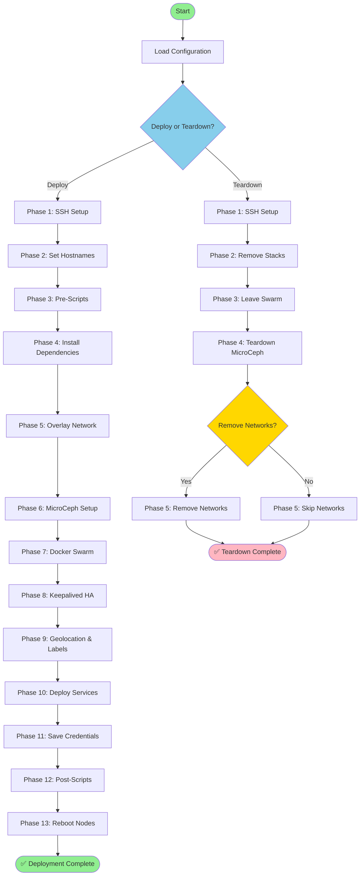

# Docker Swarm Cluster Orchestration Tool

`dscotctl` (Docker Swarm Cluster Orchestration Tool Control) is a Go-based orchestrator that automates Docker Swarm cluster deployment, management, and teardown with MicroCeph distributed storage integration via SSH.

## Quick Deploy (Copy & Paste)

Deploy a complete Docker Swarm cluster in minutes. Copy and paste these commands:

```bash
# Download binary, config example, and make executable (Linux amd64)
curl -fsSL https://raw.githubusercontent.com/Grace-Solutions/Docker-Swarm-Cluster-Orchestration-Tool/main/binaries/dscotctl-linux-amd64 -o dscotctl && \
curl -fsSL https://raw.githubusercontent.com/Grace-Solutions/Docker-Swarm-Cluster-Orchestration-Tool/main/binaries/dscotctl.json.example -o dscotctl.json && \
chmod +x dscotctl && \
echo "✅ Downloaded! Now edit dscotctl.json with your nodes and run: ./dscotctl -config dscotctl.json"

# EDIT YOUR CONFIG: Update nodes, credentials, and settings
nano dscotctl.json

# Deploy the cluster
./dscotctl -config dscotctl.json
```

<details>
<summary>Other architectures (ARM64, macOS, Windows)</summary>

```bash
# Linux ARM64
curl -fsSL https://raw.githubusercontent.com/Grace-Solutions/Docker-Swarm-Cluster-Orchestration-Tool/main/binaries/dscotctl-linux-arm64 -o dscotctl && chmod +x dscotctl

# macOS Intel
curl -fsSL https://raw.githubusercontent.com/Grace-Solutions/Docker-Swarm-Cluster-Orchestration-Tool/main/binaries/dscotctl-darwin-amd64 -o dscotctl && chmod +x dscotctl

# macOS Apple Silicon
curl -fsSL https://raw.githubusercontent.com/Grace-Solutions/Docker-Swarm-Cluster-Orchestration-Tool/main/binaries/dscotctl-darwin-arm64 -o dscotctl && chmod +x dscotctl

# Windows (PowerShell)
Invoke-WebRequest -Uri "https://raw.githubusercontent.com/Grace-Solutions/Docker-Swarm-Cluster-Orchestration-Tool/main/binaries/dscotctl-windows-amd64.exe" -OutFile "dscotctl.exe"
Invoke-WebRequest -Uri "https://raw.githubusercontent.com/Grace-Solutions/Docker-Swarm-Cluster-Orchestration-Tool/main/binaries/dscotctl.json.example" -OutFile "dscotctl.json"
```
</details>

---

## What This Tool Does

This tool transforms bare Linux servers into a fully operational Docker Swarm cluster with:

| Component | Description |
|-----------|-------------|
| **Docker Swarm** | Container orchestration platform for deploying and scaling services across multiple nodes with built-in load balancing and service discovery |
| **MicroCeph** | Lightweight Ceph storage cluster providing distributed block storage, CephFS (shared filesystem), and optional S3-compatible object storage via RADOS Gateway |
| **Keepalived** | VRRP-based high availability providing a floating Virtual IP (VIP) that automatically fails over between nodes for uninterrupted access |
| **NginxUI** | Web-based Nginx management interface with visual site configuration, SSL certificate management, and real-time monitoring |
| **Portainer** | Docker management GUI for visualizing containers, stacks, networks, and volumes with role-based access control |
| **Overlay Networks** | Secure mesh networking via Netbird, Tailscale, or WireGuard for cross-node communication over public/private networks |

---

## Features

- ✅ **Automated Deployment** - Deploy complete Docker Swarm clusters from JSON configuration
- ✅ **SSH-Based Orchestration** - Server-initiated connections, no agents required
- ✅ **MicroCeph Integration** - Distributed storage with CephFS and optional S3 (RADOS Gateway)
- ✅ **Keepalived HA** - Floating Virtual IP for high availability load balancing
- ✅ **NginxUI + Portainer** - Pre-configured management interfaces accessible via reverse proxy
- ✅ **Overlay Networking** - Support for Netbird, Tailscale, and WireGuard
- ✅ **Service Deployment** - Generic YAML-based service deployment system
- ✅ **Teardown/Reset** - Clean cluster removal with optional data preservation
- ✅ **Geolocation Detection** - Automatic region detection and node labeling
- ✅ **Credentials Management** - Auto-generated credentials saved to shared storage

## Deployment & Teardown Flow



---

## Usage

### Deploy a Cluster

```bash
./dscotctl -config dscotctl.json
```

### Teardown a Cluster

```bash
# Teardown cluster (keeps networks and data for connectivity)
./dscotctl -config dscotctl.json -teardown

# Full teardown (removes everything including overlays - WARNING: destructive)
./dscotctl -config dscotctl.json -teardown -remove-overlays
```

---

## Deployment Phases

| Phase | Name | Description |
|-------|------|-------------|
| 1 | SSH Connection Pool | Establish parallel SSH connections to all nodes |
| 2 | Set Hostnames | Idempotently set new hostnames (if configured) |
| 3 | Pre-Deployment Scripts | Execute custom scripts before setup |
| 4 | Install Dependencies | Install Docker, overlay provider, MicroCeph |
| 5 | Configure Overlay Network | Setup VPN mesh (Netbird/Tailscale/WireGuard) |
| 6 | Setup MicroCeph | Create distributed storage cluster with CephFS and S3 |
| 7 | Setup Docker Swarm | Initialize swarm and join nodes |
| 8 | Configure Keepalived | Setup floating VIP for high availability |
| 9 | Geolocation & Labels | Auto-detect region and apply all node labels |
| 10 | Deploy Services | Deploy NginxUI, Portainer, and custom services |
| 11 | Save Credentials | Write access URLs and credentials to shared storage |
| 12 | Post-Deployment Scripts | Execute custom scripts after setup |
| 13 | Reboot Nodes | Gracefully reboot nodes (if configured) |
| 14 | SSH Key Cleanup | Remove SSH keys from nodes (if configured) |

### Teardown Phases

| Phase | Name | Description |
|-------|------|-------------|
| 1 | SSH Connection Pool | Establish SSH connections to all nodes |
| 2 | Remove Stacks | Remove all deployed Docker stacks |
| 3 | Leave Swarm | All nodes leave the Docker Swarm |
| 4 | Teardown MicroCeph | Unmount CephFS and optionally remove storage |
| 5 | Remove Networks | Remove overlay networks (with `-remove-overlays`) |

---

## Configuration

See `binaries/dscotctl.json.example` for a complete example.

### Global Settings

```json
{
  "globalSettings": {
    "clusterName": "docker-swarm-0001",
    "overlayProvider": "netbird",
    "overlayConfig": "--setup-key 'your-key' --allow-server-ssh",
    "sshKeyType": "ed25519",
    "distributedStorage": {
      "enabled": true,
      "provider": "microceph",
      "poolName": "docker-swarm-0001",
      "providers": {
        "microceph": {
          "snapChannel": "reef/stable",
          "mountPath": "/mnt/MicroCephFS/docker-swarm-0001",
          "allowLoopDevices": true,
          "loopDeviceSizeGB": 16,
          "enableRadosGateway": true,
          "s3BucketName": "docker-swarm"
        }
      }
    },
    "keepalived": {
      "enabled": true,
      "vip": "auto",
      "interface": "auto"
    }
  }
}
```

| Setting | Description |
|---------|-------------|
| `clusterName` | Name of the Docker Swarm cluster (required) |
| `overlayProvider` | Overlay network: `netbird`, `tailscale`, `wireguard`, or `none` |
| `overlayConfig` | Provider-specific config (setup key, auth key, etc.) |
| `sshKeyType` | SSH key type: `ed25519` (default) or `rsa` |
| `distributedStorage` | MicroCeph configuration (see below) |
| `keepalived` | Floating VIP configuration for high availability |

### MicroCeph Storage Settings

| Setting | Description |
|---------|-------------|
| `enabled` | Enable distributed storage |
| `poolName` | CephFS pool name |
| `mountPath` | Where to mount CephFS on nodes |
| `allowLoopDevices` | Use loop devices if no physical disks available |
| `loopDeviceSizeGB` | Size of loop devices in GB |
| `enableRadosGateway` | Enable S3-compatible object storage |
| `s3BucketName` | Default S3 bucket name |
| `s3CredentialsFile` | Where to save S3 credentials |

### Keepalived Settings

| Setting | Description |
|---------|-------------|
| `enabled` | Enable Keepalived VIP |
| `vip` | Virtual IP address (`auto` to scan for available IP) |
| `interface` | Network interface (`auto` to detect) |
| `routerId` | VRRP router ID (`auto` to generate) |
| `authPass` | VRRP authentication password (`auto` to generate) |

### Node Configuration

```json
{
  "nodes": [
    {
      "enabled": true,
      "sshFQDNorIP": "192.168.1.10",
      "username": "root",
      "useSSHAutomaticKeyPair": true,
      "role": "manager",
      "storageEnabled": true,
      "keepalived": { "enabled": true, "priority": "auto" },
      "labels": { "environment": "production" }
    }
  ]
}
```

| Setting | Description |
|---------|-------------|
| `sshFQDNorIP` | Hostname or IP address (required) |
| `username` | SSH username (default: `root`) |
| `password` / `privateKeyPath` | SSH authentication |
| `useSSHAutomaticKeyPair` | Auto-generate and deploy SSH keys |
| `role` | `manager`, `worker`, or `both` |
| `storageEnabled` | Enable MicroCeph on this node |
| `keepalived.enabled` | Include in VIP failover group |
| `labels` | Custom Docker node labels |
| `rebootOnCompletion` | Reboot after deployment |

---

## Deployed Services

After deployment, access your management interfaces:

| Service | Access URL | Description |
|---------|------------|-------------|
| **NginxUI** | `http://<VIP>/nginxui/` | Nginx management interface |
| **Portainer** | `http://<VIP>/portainer/` | Docker management GUI |

Credentials are saved to: `<mountPath>/secrets/nginxui-credentials.json`

```json
{
  "credentials": { "username": "admin", "password": "auto-generated" },
  "accessUrls": {
    "nginxui": ["http://172.16.32.250/nginxui/", "http://node-0/nginxui/"],
    "portainer": ["http://172.16.32.250/portainer/", "http://node-0/portainer/"]
  },
  "virtualIp": "172.16.32.250"
}
```

---

## Key Capabilities

- ✅ **Parallel execution** - All nodes configured simultaneously
- ✅ **Idempotent** - Safe to re-run, only changes what's needed
- ✅ **Auto-detection** - Geolocation, overlay IPs, advertise addresses
- ✅ **No agent required** - Server-initiated SSH connections
- ✅ **High availability** - Floating VIP with automatic failover

---

## Automatic Node Labels

The deployer applies comprehensive labels to each Docker Swarm node:

**Geolocation** (detected via ip-api.com):
- `geo.public-ip`, `geo.country`, `geo.country-code`, `geo.region`, `geo.city`, `geo.timezone`, `geo.isp`

**Infrastructure**:
- `overlay.provider`, `storage.enabled`, `storage.provider`, `storage.mount-path`, `cluster.name`, `node.role`

```bash
# Deploy to US nodes only
docker service create --constraint 'node.labels.geo.country-code==us' nginx

# Deploy to storage-enabled nodes
docker service create --constraint 'node.labels.storage.enabled==true' postgres
```

---

## SSH Authentication

| Method | Description |
|--------|-------------|
| `password` | Direct password authentication |
| `privateKeyPath` | Existing SSH private key file |
| `useSSHAutomaticKeyPair` | Auto-generate Ed25519/RSA key pair |

Auto-generated keys are stored in `sshkeys/<uuid>/` next to the binary and reused across deployments.

## Pre/Post Deployment Scripts

Execute custom scripts before or after deployment:

```json
{
  "preScripts": [
    {
      "enabled": true,
      "name": "pre-setup",
      "source": "https://example.com/pre-setup.sh",
      "parameters": "--verbose",
      "conditions": [
        { "property": "role", "operator": "=", "value": "manager" }
      ]
    }
  ],
  "postScripts": [...]
}
```

| Setting | Description |
|---------|-------------|
| `source` | HTTP/HTTPS URL to script |
| `parameters` | Command-line arguments |
| `conditions` | Only run if conditions match (role, labels, etc.) |
| `continueOnError` | Continue deployment if script fails |

---

## CLI Reference

```bash
dscotctl -config <config.json>              # Deploy cluster
dscotctl -config <config.json> -teardown    # Teardown cluster
dscotctl -config <config.json> -teardown -remove-overlays  # Full teardown
dscotctl -version                           # Show version
dscotctl -help                              # Show help
```

---

## Building from Source

```powershell
# Windows (PowerShell)
.\scripts\build.ps1
```

```bash
# Linux/macOS
GOOS=linux GOARCH=amd64 CGO_ENABLED=0 go build -o dscotctl-linux-amd64 ./cmd/dscotctl
GOOS=linux GOARCH=arm64 CGO_ENABLED=0 go build -o dscotctl-linux-arm64 ./cmd/dscotctl
GOOS=darwin GOARCH=arm64 CGO_ENABLED=0 go build -o dscotctl-darwin-arm64 ./cmd/dscotctl
```

---

## Logging

```text
[2025-01-01T12:00:00Z] - [INFO] - message
```

| Environment Variable | Description |
|---------------------|-------------|
| `DSCOTCTL_LOG_FILE` | Override log file path (default: `dscotctl.log`) |
| `DSCOTCTL_LOG_LEVEL` | Minimum log level: `debug`, `info`, `warn`, `error` |

---

## License

MIT License - See LICENSE file for details.
