# Docker Swarm Cluster Orchestration Tool

> **The Problem:** Deploying a production-ready Docker Swarm cluster manually requires hours of repetitive SSH sessions, complex configuration across every node, and deep expertise in a dozen different technologies. One misconfiguration can leave your infrastructure insecure or non-functional.

> **The Solution:** `dscotctl` transforms bare Linux servers into a fully operational, edge-load-balanced, multi-cloud Docker Swarm cluster in **under 10 minutes** from a single JSON configuration file.

---

## Why This Tool Exists

Building production infrastructure shouldn't require you to manually:

- **SSH into each server** and repeat the same commands across 3, 5, or 20 nodes
- **Configure Docker** with TLS, Swarm initialization, manager/worker join tokens, and overlay networks
- **Set up distributed storage** with Ceph/MicroCeph including OSD creation, pool configuration, CephFS mounts, and S3 gateways
- **Harden firewalls** with iptables rules that don't break Docker, overlay networks, or cluster communication
- **Deploy overlay networks** via Netbird, Tailscale, or WireGuard for secure cross-node and cross-cloud communication
- **Configure Keepalived** with VRRP, automatic ARP announcements, and virtual IP failover across nodes
- **Generate and distribute SSH keys**, manage root passwords, and handle authentication across nodes
- **Deploy management panels** like Portainer, configure reverse proxies, generate SSL certificates
- **Apply node labels** for geolocation-aware scheduling and workload placement
- **Create mount points**, service directories, and ensure permissions are correct across all nodes

**All of this complexity is reduced to editing one JSON file and running one command.**

With `dscotctl`, you can spin up multi-cloud, edge-load-balanced infrastructure ready for production workloads—or tear it all down cleanly when you're done. Build your company's infrastructure from the ground up in the time it takes to grab a coffee.

📖 **See [docs/manual-setup-comparison.md](docs/manual-setup-comparison.md) for a detailed breakdown of what you'd have to do manually for each component.**

---

## Quick Deploy (Copy & Paste)

Deploy a complete Docker Swarm cluster in minutes. Copy and paste these commands:

```bash
# Download binary, config example, and make executable (Linux amd64)
curl -fsSL https://raw.githubusercontent.com/Grace-Solutions/Docker-Swarm-Cluster-Orchestration-Tool/main/binaries/dscotctl-linux-amd64 -O && \
curl -fsSL https://raw.githubusercontent.com/Grace-Solutions/Docker-Swarm-Cluster-Orchestration-Tool/main/binaries/dscotctl.json.example -O && \
chmod +x dscotctl-linux-amd64
# Edit dscotctl.json.example with your nodes, credentials, and settings
nano dscotctl.json.example
# Deploy the cluster
./dscotctl-linux-amd64 -configpath dscotctl.json.example
```

<details>
<summary>Other architectures (ARM64, macOS, Windows)</summary>

```bash
# Linux ARM64
curl -fsSL https://raw.githubusercontent.com/Grace-Solutions/Docker-Swarm-Cluster-Orchestration-Tool/main/binaries/dscotctl-linux-arm64 -O && chmod +x dscotctl-linux-arm64

# macOS Intel
curl -fsSL https://raw.githubusercontent.com/Grace-Solutions/Docker-Swarm-Cluster-Orchestration-Tool/main/binaries/dscotctl-darwin-amd64 -O && chmod +x dscotctl-darwin-amd64

# macOS Apple Silicon
curl -fsSL https://raw.githubusercontent.com/Grace-Solutions/Docker-Swarm-Cluster-Orchestration-Tool/main/binaries/dscotctl-darwin-arm64 -O && chmod +x dscotctl-darwin-arm64

# Windows (PowerShell)
Invoke-WebRequest -Uri "https://raw.githubusercontent.com/Grace-Solutions/Docker-Swarm-Cluster-Orchestration-Tool/main/binaries/dscotctl-windows-amd64.exe" -OutFile "dscotctl-windows-amd64.exe"
Invoke-WebRequest -Uri "https://raw.githubusercontent.com/Grace-Solutions/Docker-Swarm-Cluster-Orchestration-Tool/main/binaries/dscotctl.json.example" -OutFile "dscotctl.json.example"
```
</details>

### After Deployment

Once deployment completes, your management interfaces are accessible via any node IP or the Virtual IP (if Keepalived is enabled):

| Service | URL | Description |
|---------|-----|-------------|
| **Portainer** | `http://<VIP>:9000/` or `http://<node-ip>:9000/` | Docker Swarm management GUI |
| **Nginx** | `http://<VIP>/` or `http://<node-ip>/` | Edge load balancer (reverse proxy) |

Additional optional services (disabled by default):
| Service | URL | Description |
|---------|-----|-------------|
| **VS Code Server** | `http://<VIP>:8443/` | Browser-based IDE |
| **Certmate** | Internal | Automatic SSL certificate management |

**Portainer Dashboard:**


---

## What This Tool Does

This tool transforms bare Linux servers into a fully operational Docker Swarm cluster with:

| Component | Description |
|-----------|-------------|
| **Docker Swarm** | Container orchestration platform for deploying and scaling services across multiple nodes with built-in load balancing and service discovery |
| **MicroCeph** | Lightweight Ceph storage cluster providing distributed block storage, CephFS (shared filesystem), and optional S3-compatible object storage via RADOS Gateway |
| **Keepalived** | VRRP-based high availability providing a floating Virtual IP (VIP) that automatically fails over between nodes for uninterrupted access |
| **Nginx Edge LB** | High-performance reverse proxy and load balancer deployed globally across edge nodes with SSL termination |
| **Portainer** | Docker management GUI for visualizing containers, stacks, networks, and volumes with role-based access control |
| **Overlay Networks** | Secure mesh networking via Netbird, Tailscale, or WireGuard for cross-node communication over public/private networks |
| **Firewall (iptables)** | Per-node firewall configuration with predefined security profiles (BlockAllPublic, AllowAllPrivate, Harden) and custom port rules |
| **Management Panels** | Optional web-based server management: Webmin (port 10000), 1Panel (port 10086), or Cockpit (port 9090) |

---

## Features

- ✅ **Automated Deployment** - Deploy complete Docker Swarm clusters from JSON configuration
- ✅ **SSH-Based Orchestration** - Server-initiated connections, no agents required
- ✅ **MicroCeph Integration** - Distributed storage with CephFS and optional S3 (RADOS Gateway)
- ✅ **Keepalived HA** - Floating Virtual IP for high availability load balancing
- ✅ **Nginx + Portainer** - Edge load balancer and Docker management GUI pre-configured
- ✅ **Overlay Networking** - Support for Netbird, Tailscale, and WireGuard
- ✅ **Service Deployment** - YAML-based service deployment with automatic directory creation
- ✅ **Firewall Configuration** - Per-node iptables rules with predefined security profiles
- ✅ **Management Panels** - Optional web-based server management (Webmin, 1Panel, Cockpit)
- ✅ **Teardown/Reset** - Clean cluster removal with optional data preservation
- ✅ **Geolocation Detection** - Automatic region detection and node labeling
- ✅ **Dynamic Configuration** - Bind mount directories auto-created, constraints auto-adjusted

## Deployment & Teardown Flow

```mermaid
graph TB
    Start([Start]) --> Config[Load Configuration]
    Config --> Deploy{Deploy or Teardown?}

    Deploy -->|Deploy| SSH1[Phase 1: SSH Setup]
    SSH1 --> Hostname[Phase 2: Set Hostnames]
    Hostname --> PreScript[Phase 3: Pre-Scripts]
    PreScript --> Deps[Phase 4: Install Dependencies]
    Deps --> Overlay[Phase 5: Overlay Network]
    Overlay --> Storage[Phase 6: MicroCeph Setup]
    Storage --> Swarm[Phase 7: Docker Swarm]
    Swarm --> Keepalived[Phase 8: Keepalived HA]
    Keepalived --> Labels[Phase 9: Geolocation & Labels]
    Labels --> Services[Phase 10: Deploy Services]
    Services --> Credentials[Phase 11: Save Credentials]
    Credentials --> PostScript[Phase 12: Post-Scripts]
    PostScript --> Reboot[Phase 13: Reboot Nodes]
    Reboot --> Complete1([✅ Deployment Complete])

    Deploy -->|Teardown| SSH2[Phase 1: SSH Setup]
    SSH2 --> RemoveStacks[Phase 2: Remove Stacks]
    RemoveStacks --> LeaveSwarm[Phase 3: Leave Swarm]
    LeaveSwarm --> TeardownStorage[Phase 4: Teardown MicroCeph]
    TeardownStorage --> NetworkDecision{Remove Networks?}
    NetworkDecision -->|Yes| RemoveNetworks[Phase 5: Remove Networks]
    NetworkDecision -->|No| SkipNetworks[Phase 5: Skip Networks]
    RemoveNetworks --> Complete2([✅ Teardown Complete])
    SkipNetworks --> Complete2

    style Start fill:#90EE90
    style Complete1 fill:#90EE90
    style Complete2 fill:#FFB6C1
    style Deploy fill:#87CEEB
    style NetworkDecision fill:#FFD700
```



---

## Usage

### Deploy a Cluster

```bash
./dscotctl-linux-amd64 -configpath dscotctl.json.example
```

### Teardown a Cluster

```bash
# Teardown cluster (keeps networks and data for connectivity)
./dscotctl-linux-amd64 -configpath dscotctl.json.example -teardown

# Full teardown (removes everything including overlays - WARNING: destructive)
./dscotctl-linux-amd64 -configpath dscotctl.json.example -teardown -remove-overlays
```

---

## Deployment Phases

| Phase | Name | Description |
|-------|------|-------------|
| 1 | SSH Connection Pool | Establish parallel SSH connections to all nodes |
| 2 | Set Hostnames | Idempotently set new hostnames (if configured) |
| 3 | Pre-Deployment Scripts | Execute custom scripts before setup |
| 4 | Install Dependencies | Install Docker, overlay provider, MicroCeph |
| 5 | Configure Overlay Network | Setup VPN mesh (Netbird/Tailscale/WireGuard) |
| 6 | Setup MicroCeph | Create distributed storage cluster with CephFS and S3 |
| 7 | Setup Docker Swarm | Initialize swarm and join nodes |
| 8 | Configure Keepalived | Setup floating VIP for high availability |
| 9 | Geolocation & Labels | Auto-detect region and apply all node labels |
| 10 | Deploy Services | Deploy Nginx, Portainer, and custom services |
| 11 | Save Credentials | Write access URLs and credentials to shared storage |
| 12 | Post-Deployment Scripts | Execute custom scripts after setup |
| 13 | Reboot Nodes | Gracefully reboot nodes (if configured) |
| 14 | SSH Key Cleanup | Remove SSH keys from nodes (if configured) |

### Teardown Phases

| Phase | Name | Description |
|-------|------|-------------|
| 1 | SSH Connection Pool | Establish SSH connections to all nodes |
| 2 | Remove Stacks | Remove all deployed Docker stacks |
| 3 | Leave Swarm | All nodes leave the Docker Swarm |
| 4 | Teardown MicroCeph | Unmount CephFS and optionally remove storage |
| 5 | Remove Networks | Remove overlay networks (with `-remove-overlays`) |

---

## Configuration

See `binaries/dscotctl.json.example` for a complete example.

### Global Settings

```json
{
  "globalSettings": {
    "clusterName": "docker-swarm-0001",
    "overlayProvider": "netbird",
    "overlayConfig": "--setup-key 'your-key' --allow-server-ssh",
    "sshKeyType": "ed25519",
    "distributedStorage": {
      "enabled": true,
      "provider": "microceph",
      "poolName": "docker-swarm-0001",
      "providers": {
        "microceph": {
          "snapChannel": "reef/stable",
          "mountPath": "/mnt/MicroCephFS/docker-swarm-0001",
          "allowLoopDevices": true,
          "loopDeviceSizeGB": 16,
          "enableRadosGateway": true,
          "s3BucketName": "docker-swarm"
        }
      }
    },
    "keepalived": {
      "enabled": true,
      "vip": "auto",
      "interface": "auto"
    }
  }
}
```

| Setting | Description |
|---------|-------------|
| `clusterName` | Name of the Docker Swarm cluster (required) |
| `overlayProvider` | Overlay network: `netbird`, `tailscale`, `wireguard`, or `none` |
| `overlayConfig` | Provider-specific config (setup key, auth key, etc.) |
| `sshKeyType` | SSH key type: `ed25519` (default) or `rsa` |
| `distributedStorage` | MicroCeph configuration (see below) |
| `keepalived` | Floating VIP configuration for high availability |

### MicroCeph Storage Settings

| Setting | Description |
|---------|-------------|
| `enabled` | Enable distributed storage |
| `poolName` | CephFS pool name |
| `mountPath` | Where to mount CephFS on nodes |
| `allowLoopDevices` | Use loop devices if no physical disks available |
| `loopDeviceSizeGB` | Size of loop devices in GB |
| `enableRadosGateway` | Enable S3-compatible object storage |
| `s3BucketName` | Default S3 bucket name |
| `s3CredentialsFile` | Where to save S3 credentials |

### Keepalived Settings

| Setting | Description |
|---------|-------------|
| `enabled` | Enable Keepalived VIP |
| `vip` | Virtual IP address (`auto` to scan for available IP) |
| `interface` | Network interface (`auto` to detect) |
| `routerId` | VRRP router ID (`auto` to generate) |
| `authPass` | VRRP authentication password (`auto` to generate) |

### Node Configuration

```json
{
  "nodes": [
    {
      "enabled": true,
      "sshFQDNorIP": "192.168.1.10",
      "username": "root",
      "useSSHAutomaticKeyPair": true,
      "role": "manager",
      "storageEnabled": true,
      "keepalived": { "enabled": true, "priority": "auto" },
      "labels": { "environment": "production", "EdgeLoadBalancer": "true" },
      "managementPanel": { "enabled": true, "type": "webmin" },
      "firewall": { "configurationEnabled": true, "profiles": [...], "ports": [...] }
    }
  ]
}
```

| Setting | Description |
|---------|-------------|
| `sshFQDNorIP` | Hostname or IP address (required) |
| `username` | SSH username (default: `root`) |
| `password` / `privateKeyPath` | SSH authentication |
| `useSSHAutomaticKeyPair` | Auto-generate and deploy SSH keys |
| `role` | `manager`, `worker`, or `both` |
| `storageEnabled` | Enable MicroCeph on this node |
| `keepalived.enabled` | Include in VIP failover group |
| `labels` | Custom Docker node labels (use `EdgeLoadBalancer: true` for Nginx edge LB) |
| `managementPanel` | Web-based server management panel (see below) |
| `firewall` | Per-node firewall (iptables) configuration (see below) |
| `rebootOnCompletion` | Reboot after deployment |

### Management Panel Configuration

Install a web-based server management panel on individual nodes:

```json
{
  "managementPanel": {
    "enabled": true,
    "type": "webmin"
  }
}
```

| Setting | Description |
|---------|-------------|
| `enabled` | Enable management panel installation |
| `type` | Panel type: `webmin`, `1panel`, or `cockpit` |

**Supported Panels:**

| Panel | Port | Description |
|-------|------|-------------|
| `webmin` | 10000 | Full-featured web-based system administration |
| `1panel` | 10086 | Modern server management panel (Docker-native) |
| `cockpit` | 9090 | Lightweight, systemd-integrated web console |

### Firewall Configuration

Configure iptables firewall rules per-node. Uses predefined profiles and custom port rules.

**Safety Guarantees:**
- ✅ **Never flushes chains** - Existing rules from Docker, overlays, Keepalived are preserved
- ✅ **Docker chains preserved** - Never touches FORWARD chain; Docker bridge interfaces always allowed
- ✅ **Overlay networks protected** - Netbird (wt0), Tailscale (tailscale0), WireGuard (wg0) interfaces/ports always allowed
- ✅ **Keepalived VRRP protected** - IP protocol 112 (VRRP) and multicast 224.0.0.18 always allowed
- ✅ **Docker Swarm ports allowed** - Ports 2377, 7946, 4789 for cluster communication
- ✅ **Rules persist across reboots** - Automatically installs `iptables-persistent` and saves to `/etc/iptables/rules.v4`
- ✅ **Backup created** - Existing rules backed up to `/root/iptables-backup-*.rules` before changes

```json
{
  "firewall": {
    "configurationEnabled": true,
    "profiles": [
      { "enabled": true, "name": "BlockAllPublic" },
      { "enabled": true, "name": "AllowAllPrivate" },
      { "enabled": true, "name": "Harden" }
    ],
    "ports": [
      {
        "enabled": true,
        "protocol": ["TCP"],
        "rangeList": [80, 443],
        "sources": ["0.0.0.0/0"],
        "action": "ACCEPT",
        "comment": "Allow HTTP/HTTPS from anywhere"
      },
      {
        "enabled": true,
        "protocol": ["TCP", "UDP"],
        "rangeList": ["4500-6500"],
        "sources": ["private", "cgnat"],
        "action": "ACCEPT",
        "comment": "Allow custom ports from private networks"
      }
    ]
  }
}
```

| Setting | Description |
|---------|-------------|
| `configurationEnabled` | Enable firewall rule processing (does NOT disable OS firewall when false) |
| `profiles` | Predefined security profiles to apply (in order) |
| `ports` | Custom port rules (applied after profiles) |

**Firewall Profiles:**

| Profile | Description |
|---------|-------------|
| `BlockAllPublic` | Block all inbound from public IPs, allow only established/related + loopback, set INPUT policy to DROP |
| `AllowAllPrivate` | Allow all traffic from RFC1918 (10.x, 172.16.x, 192.168.x) + RFC6598 CGNAT (100.64.x) |
| `Harden` | Security hardening: SSH rate limiting (4/min), SYN flood protection, ICMP limits, drop invalid packets |

**Port Rule Settings:**

| Setting | Description |
|---------|-------------|
| `protocol` | Array of protocols: `["TCP"]`, `["UDP"]`, or `["TCP", "UDP"]` |
| `rangeList` | Ports or ranges: `[80, 443, "4500-6500"]` |
| `sources` | Source CIDRs or shortcuts: `["private", "cgnat", "10.0.0.0/8"]` |
| `action` | `ACCEPT` or `DROP` (default: `ACCEPT`) |
| `comment` | Optional description |

**Source Shortcuts:**

| Shortcut | Expands To |
|----------|------------|
| `private` | `10.0.0.0/8`, `172.16.0.0/12`, `192.168.0.0/16` (RFC1918) |
| `cgnat` | `100.64.0.0/10` (RFC6598 Carrier-Grade NAT) |
| `any` | `0.0.0.0/0` (all sources) |

---

## Deployed Services

The following services are deployed automatically (can be enabled/disabled via service YAML files):

| Service | Access | Description |
|---------|--------|-------------|
| **Portainer Agent** | Internal | Enables Portainer to manage containers across all Swarm nodes |
| **Nginx (EdgeLoadBalancer)** | `http://<VIP>/` or `https://<VIP>/` | Global edge load balancer with SSL termination |
| **Portainer** | `http://<VIP>:9000/` | Docker Swarm management GUI |

Optional services (disabled by default in service YAML):

| Service | Access | Description |
|---------|--------|-------------|
| **VS Code Server** | `http://<VIP>:8443/` | Browser-based IDE for development |
| **Certmate** | Internal | Automatic SSL certificate management |

S3 credentials (if RADOS Gateway enabled) are saved to: `<mountPath>/secrets/s3-credentials.json`

```json
{
  "accessKey": "ABCD1234...",
  "secretKey": "xyz789...",
  "endpoint": "http://<node-ip>:7480",
  "bucket": "docker-swarm-0001"
}
```

---

## Key Capabilities

- ✅ **Parallel execution** - All nodes configured simultaneously
- ✅ **Idempotent** - Safe to re-run, only changes what's needed
- ✅ **Auto-detection** - Geolocation, overlay IPs, advertise addresses
- ✅ **No agent required** - Server-initiated SSH connections
- ✅ **High availability** - Floating VIP with automatic failover

---

## Automatic Node Labels

The deployer applies comprehensive labels to each Docker Swarm node:

**Geolocation** (detected via ip-api.com):
- `geo.public-ip`, `geo.country`, `geo.country-code`, `geo.region`, `geo.city`, `geo.timezone`, `geo.isp`

**Infrastructure**:
- `overlay.provider`, `storage.enabled`, `storage.provider`, `storage.mount-path`, `cluster.name`, `node.role`

```bash
# Deploy to US nodes only
docker service create --constraint 'node.labels.geo.country-code==us' nginx

# Deploy to storage-enabled nodes
docker service create --constraint 'node.labels.storage.enabled==true' postgres
```

---

## SSH Authentication

| Method | Description |
|--------|-------------|
| `password` | Direct password authentication |
| `privateKeyPath` | Existing SSH private key file |
| `useSSHAutomaticKeyPair` | Auto-generate Ed25519/RSA key pair |

Auto-generated keys are stored in `sshkeys/<uuid>/` next to the binary and reused across deployments.

## Pre/Post Deployment Scripts

Execute custom scripts before or after deployment:

```json
{
  "preScripts": [
    {
      "enabled": true,
      "name": "pre-setup",
      "source": "https://example.com/pre-setup.sh",
      "parameters": "--verbose",
      "conditions": [
        { "property": "role", "operator": "=", "value": "manager" }
      ]
    }
  ],
  "postScripts": [...]
}
```

| Setting | Description |
|---------|-------------|
| `source` | HTTP/HTTPS URL to script |
| `parameters` | Command-line arguments |
| `conditions` | Only run if conditions match (role, labels, etc.) |
| `continueOnError` | Continue deployment if script fails |

---

## CLI Reference

```bash
dscotctl-linux-amd64 -configpath <config.json>              # Deploy cluster
dscotctl-linux-amd64 -configpath <config.json> -teardown    # Teardown cluster
dscotctl-linux-amd64 -configpath <config.json> -teardown -remove-overlays  # Full teardown
dscotctl-linux-amd64 -version                               # Show version
dscotctl-linux-amd64 -help                                  # Show help
```

---

## Building from Source

```powershell
# Windows (PowerShell)
.\scripts\build.ps1
```

```bash
# Linux/macOS
GOOS=linux GOARCH=amd64 CGO_ENABLED=0 go build -o dscotctl-linux-amd64 ./cmd/dscotctl
GOOS=linux GOARCH=arm64 CGO_ENABLED=0 go build -o dscotctl-linux-arm64 ./cmd/dscotctl
GOOS=darwin GOARCH=arm64 CGO_ENABLED=0 go build -o dscotctl-darwin-arm64 ./cmd/dscotctl
```

---

## Logging

```text
[2025-01-01T12:00:00Z] - [INFO] - message
```

| Environment Variable | Description |
|---------------------|-------------|
| `DSCOTCTL_LOG_FILE` | Override log file path (default: `dscotctl.log`) |
| `DSCOTCTL_LOG_LEVEL` | Minimum log level: `debug`, `info`, `warn`, `error` |

---

## License

MIT License - See LICENSE file for details.
